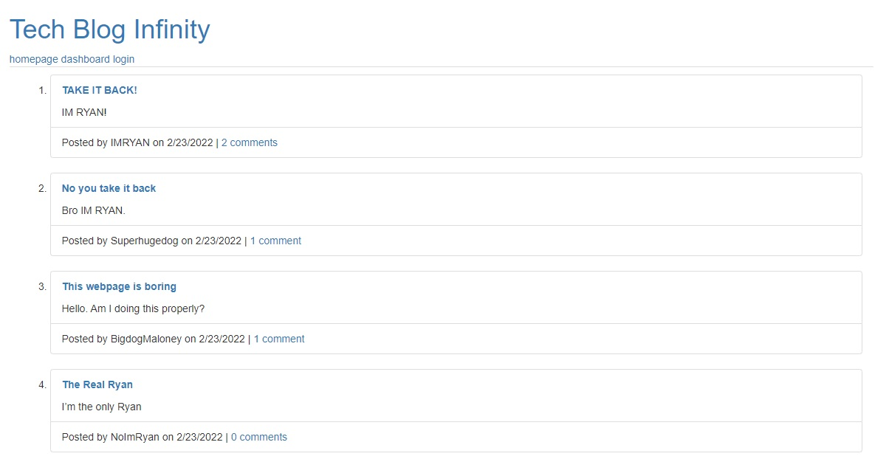

# Tech Blog Infinity

Welcome to Tech Blog Infinity, where we assume the storage capacity of JawsDB is approximately infinity. Share thoughs with the community and comment on those thoughts with counter-thoughts. 

## Application

### Installation

The application is deployed on Heroku at the following URL: https://tech-blog-infinity.herokuapp.com/

No installation is required - you only need to create an account.

### Use

The primary functionality of the application consists the homepage and the dashboard page. Access these pages from the navigation bar at the top of the page.

### Homepage

The homepage displays all of the posts in chronological order. Clicking on the post title or the comments link will take the user to the single-post page, where all comments are visible. When the user is logged in, they can add comments to the post.

### Dashboard

The dashboard can only be accessed while to user is logged in. It connects user to the functioning pages that allos them to create a new post, edit one of their existing posts, or delete a post.

## Alpha Testing

Initial testing is underway - I sent the app to a group of friends for them to populate the database. Immediate major outcry involved a character limit on the posts. Looking into it, this appears to be caused by the definition of `post_text` in the Post model. It's datatype is `STRING`, which automatically sets a character limit of 255. This can be recitified by changing the datatype to `TEXT`, which is the datatype I chose for `comment_text` in the Comment model. For now I have left the database as-is, because it will be cleared if I make the change. Future project would be to figure out how to change the datatype of `post_text` without losing any data.

## Collaboration

If you would like to expand on this project, please reach out to me at ddoherty6@gmail.com